# Benchmark of `typescript-json`
> CPU: Intel(R) Core(TM) i7-6700 CPU @ 3.40GHz
> Memory: 16,323 MB
> NodeJS version: v18.6.0

## assert
 Components | typescript-json | typescript-is 
------------|-----------------|---------------
object (hierarchical) | 18658.06571375534 | 16022.569149838793
object (recursive) | 22835.105390785302 | 15518.631314940882
object (union) | 3509.774990778311 | 1500.1767408978437
array (recursive) | 1060.3204524033931 | 1077.3381294964029
array (union) | 2339.1660461653014 | 151.71790235081374
ultimate union | 3219.829925818708 | 21.727515583259127

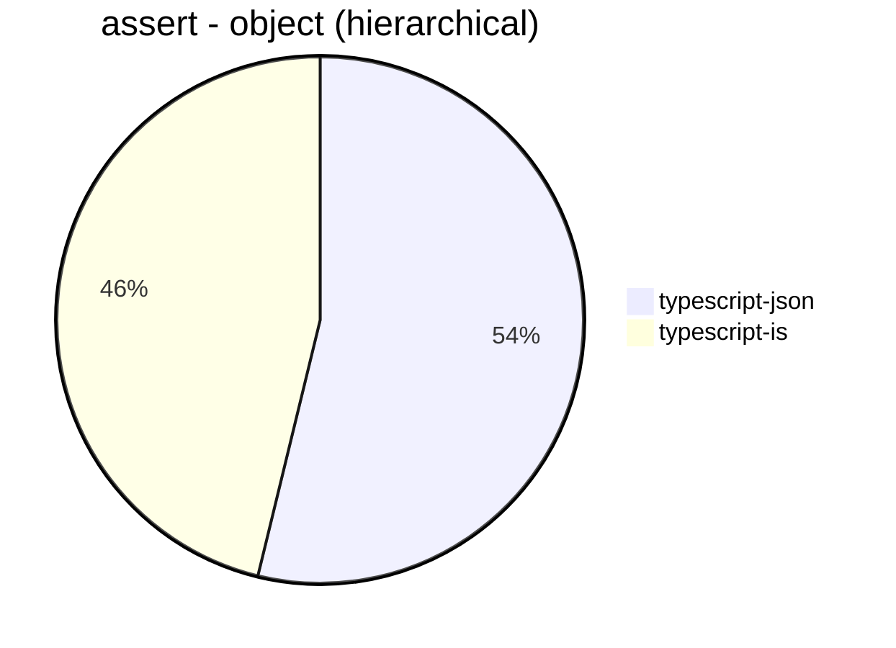
```mermaid
pie title assert - object (hierarchical)
  "typescript-json": 18658.06571375534
  "typescript-is": 16022.569149838793
```

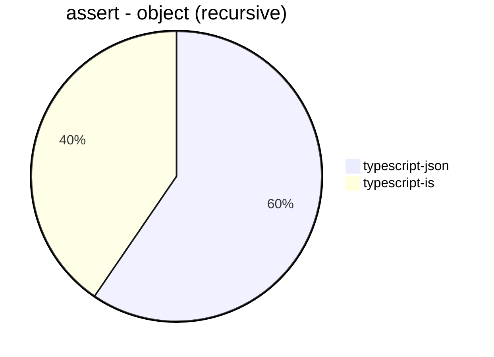
```mermaid
pie title assert - object (recursive)
  "typescript-json": 22835.105390785302
  "typescript-is": 15518.631314940882
```

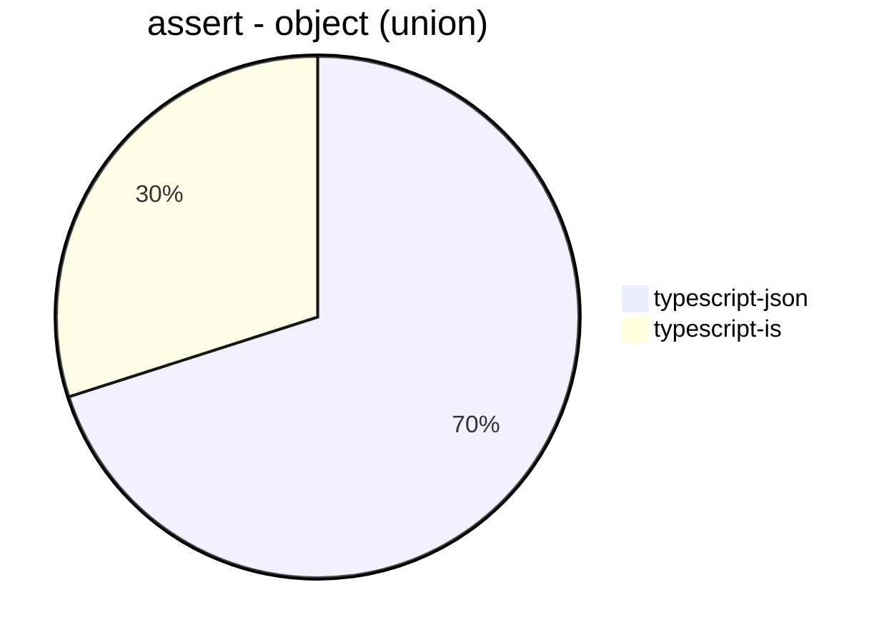
```mermaid
pie title assert - object (union)
  "typescript-json": 3509.774990778311
  "typescript-is": 1500.1767408978437
```

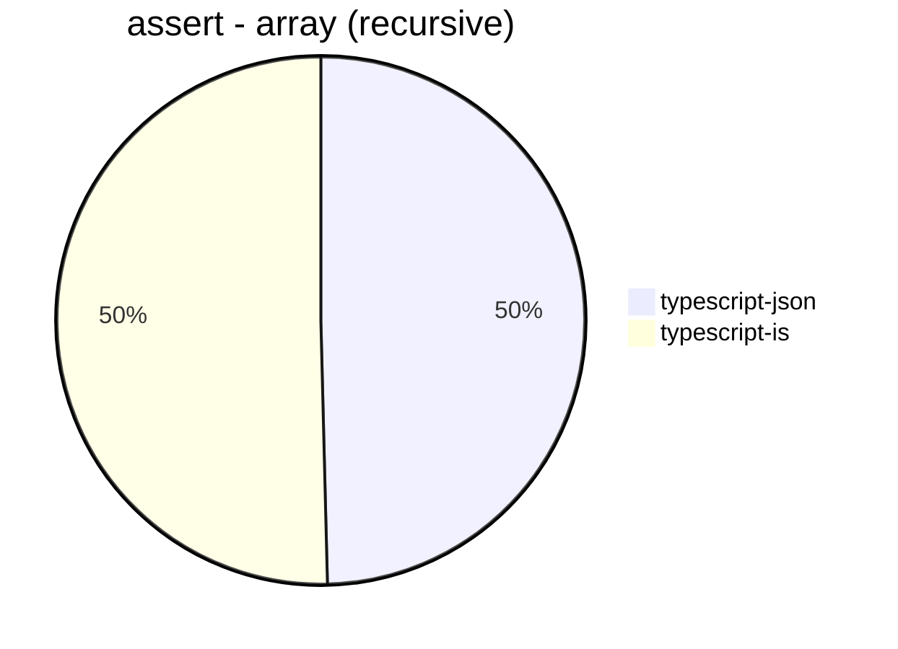
```mermaid
pie title assert - array (recursive)
  "typescript-json": 1060.3204524033931
  "typescript-is": 1077.3381294964029
```

```mermaid
pie title assert - array (union)
  "typescript-json": 2339.1660461653014
  "typescript-is": 151.71790235081374
```

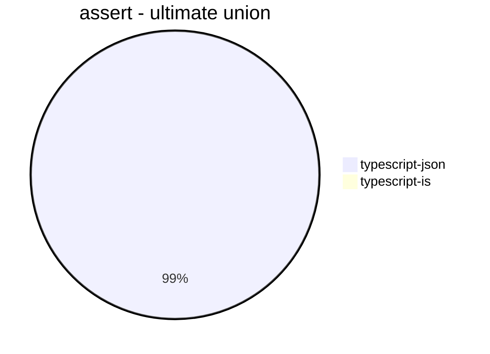
```mermaid
pie title assert - ultimate union
  "typescript-json": 3219.829925818708
  "typescript-is": 21.727515583259127
```

## is
 Components | typescript-json | typescript-is | ajv 
------------|-----------------|---------------|-----
object (hierarchical) | 63980.50189564904 | 30048.274596182084 | 33540.467137425316
object (recursive) | 45414.401440144014 | 23866.305329719962 | Failed
object (union, explicit) | 9056.453110492108 | Failed | 1038.3046639475083
object (union, implicit) | 6250.229990800369 | Failed | Failed
array (recursive) | 3308.9460340456353 | 2224.558303886926 | Failed
array (union, explicit) | 4187.904967602592 | 671.7780840799448 | Failed
array (union, implicit) | 4768.89052709178 | 772.5794797687862 | Failed
ultimate union | 7112.133734034561 | 205.9504721182968 | Failed

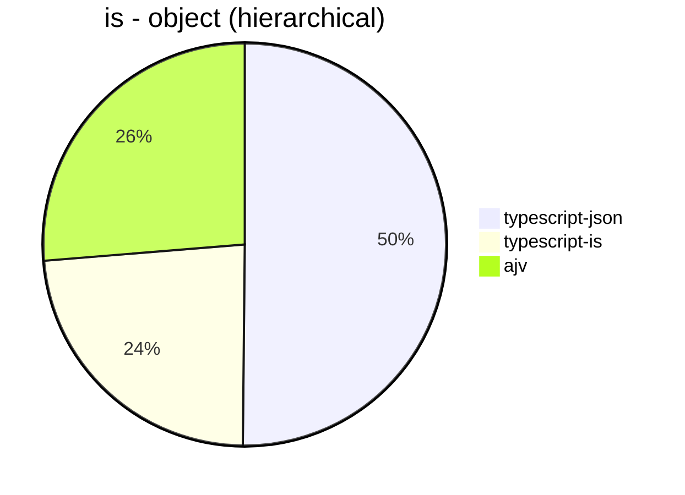
```mermaid
pie title is - object (hierarchical)
  "typescript-json": 63980.50189564904
  "typescript-is": 30048.274596182084
  "ajv": 33540.467137425316
```

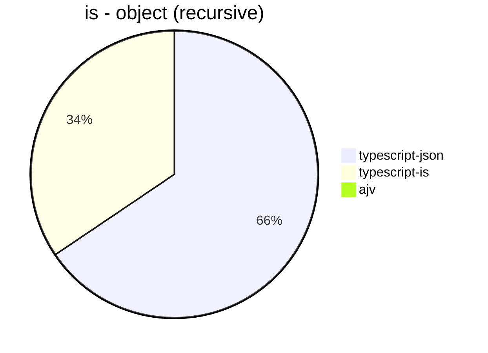
```mermaid
pie title is - object (recursive)
  "typescript-json": 45414.401440144014
  "typescript-is": 23866.305329719962
  "ajv": 0
```

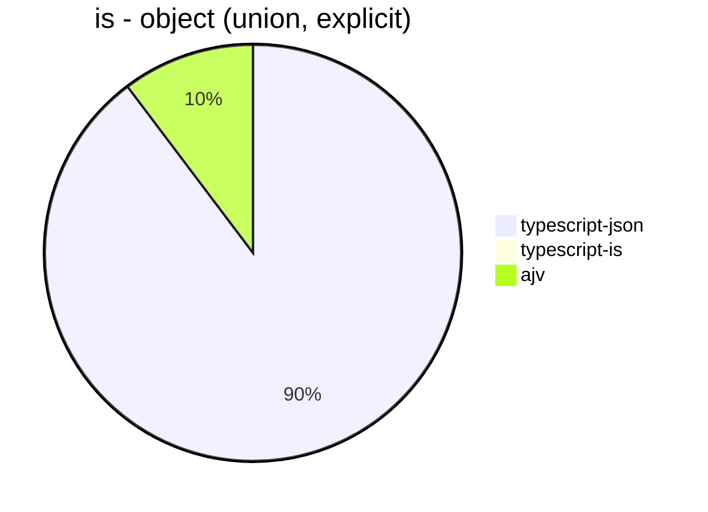
```mermaid
pie title is - object (union, explicit)
  "typescript-json": 9056.453110492108
  "typescript-is": 0
  "ajv": 1038.3046639475083
```

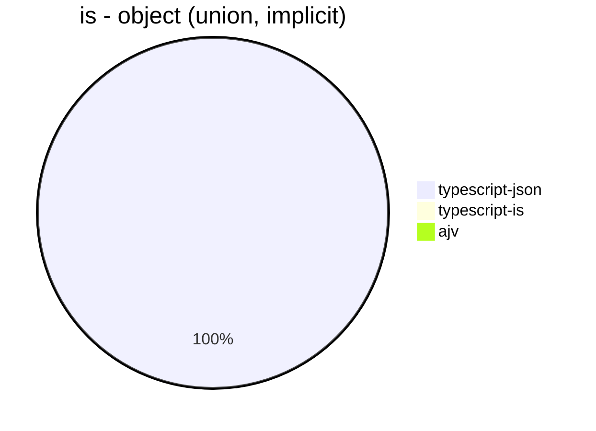
```mermaid
pie title is - object (union, implicit)
  "typescript-json": 6250.229990800369
  "typescript-is": 0
  "ajv": 0
```

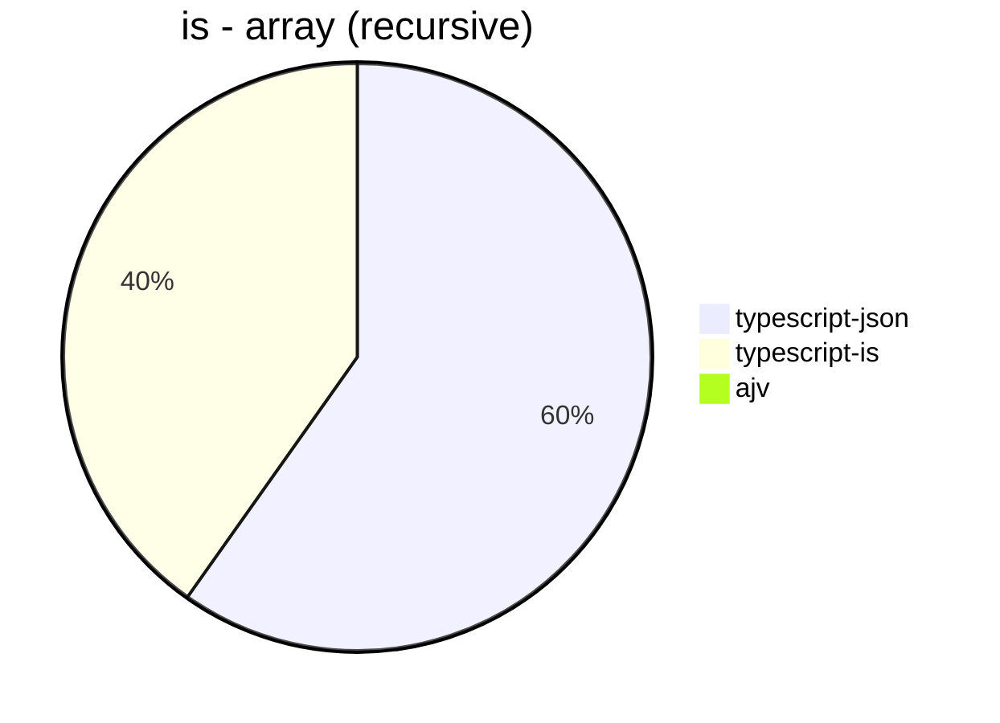
```mermaid
pie title is - array (recursive)
  "typescript-json": 3308.9460340456353
  "typescript-is": 2224.558303886926
  "ajv": 0
```

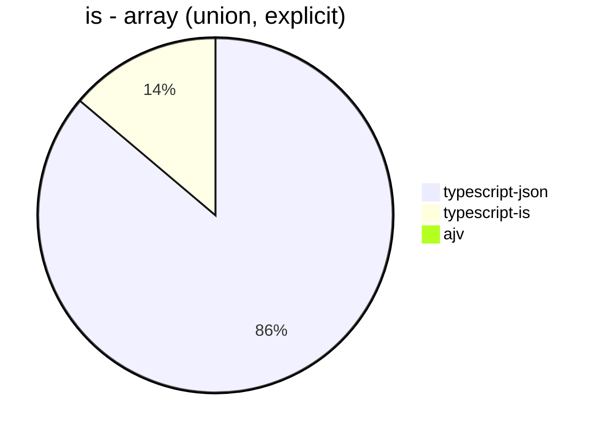
```mermaid
pie title is - array (union, explicit)
  "typescript-json": 4187.904967602592
  "typescript-is": 671.7780840799448
  "ajv": 0
```

```mermaid
pie title is - array (union, implicit)
  "typescript-json": 4768.89052709178
  "typescript-is": 772.5794797687862
  "ajv": 0
```

```mermaid
pie title is - ultimate union
  "typescript-json": 7112.133734034561
  "typescript-is": 205.9504721182968
  "ajv": 0
```

## optimizer
 Components | typescript-json | fast-json-stringify | JSON.stringify() 
------------|-----------------|---------------------|------------------
object (simple) | 28893.632819751256 | 4.758418740849194 | 5391.2885662431945
object (hierarchical) | 4365.283151600423 | 0.9152480322167307 | 1343.4325108853411
object (recursive) | 4170.465073188809 | 29.965907051857165 | 1059.2676481691203
object (union) | 1528.267254038179 | 0.728066982162359 | 764.9186256781193
array (hierarchical) | 81.86283427323995 | 1.8577001671930151 | 43.72799703539003
array (recursive) | 190.97345132743362 | 25.993044114955154 | 110.35747021081576
array (union) | 292.57720787430014 | 1.4842300556586272 | 209.63636363636363
ultimate union | 990.3915881073242 | Failed | 158.51481613709387

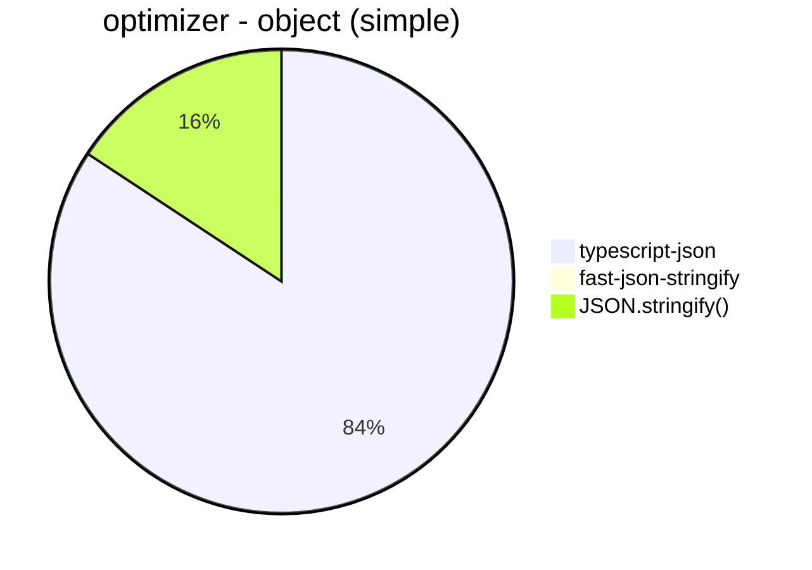
```mermaid
pie title optimizer - object (simple)
  "typescript-json": 28893.632819751256
  "fast-json-stringify": 4.758418740849194
  "JSON.stringify()": 5391.2885662431945
```

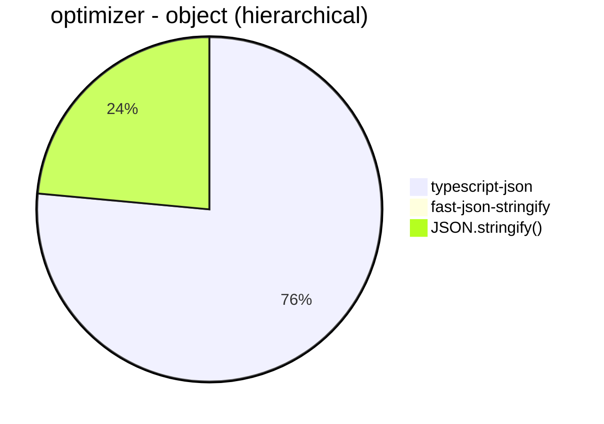
```mermaid
pie title optimizer - object (hierarchical)
  "typescript-json": 4365.283151600423
  "fast-json-stringify": 0.9152480322167307
  "JSON.stringify()": 1343.4325108853411
```

```mermaid
pie title optimizer - object (recursive)
  "typescript-json": 4170.465073188809
  "fast-json-stringify": 29.965907051857165
  "JSON.stringify()": 1059.2676481691203
```

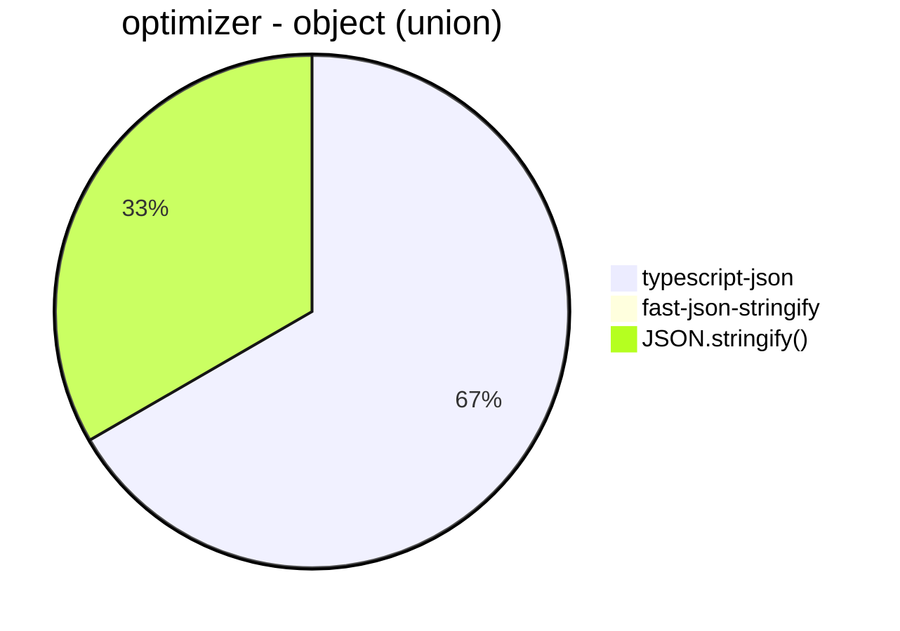
```mermaid
pie title optimizer - object (union)
  "typescript-json": 1528.267254038179
  "fast-json-stringify": 0.728066982162359
  "JSON.stringify()": 764.9186256781193
```

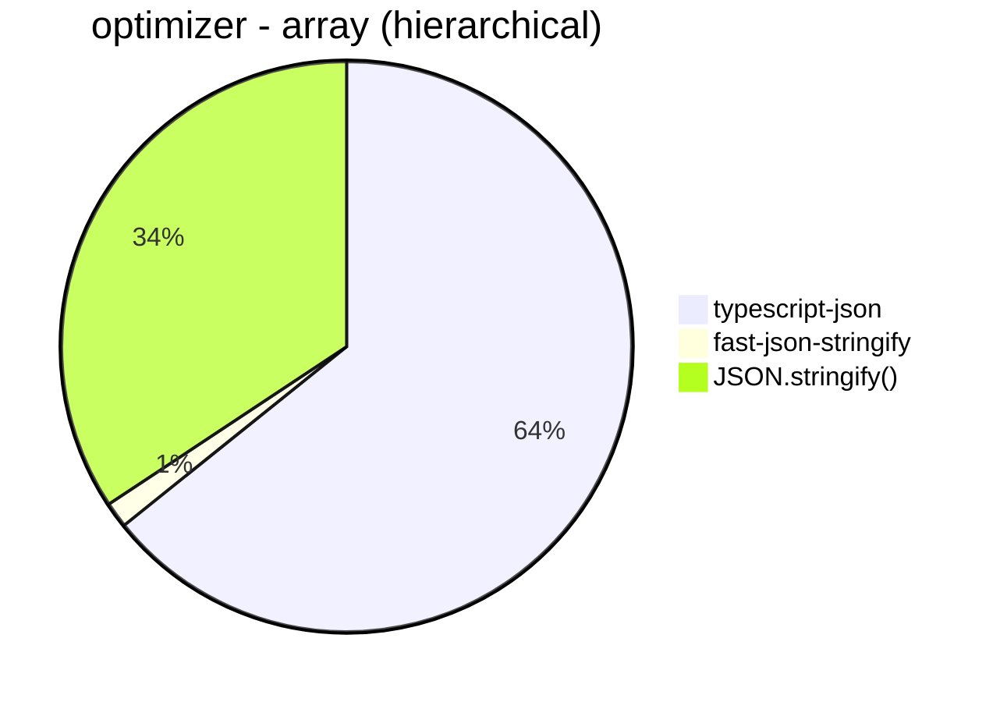
```mermaid
pie title optimizer - array (hierarchical)
  "typescript-json": 81.86283427323995
  "fast-json-stringify": 1.8577001671930151
  "JSON.stringify()": 43.72799703539003
```

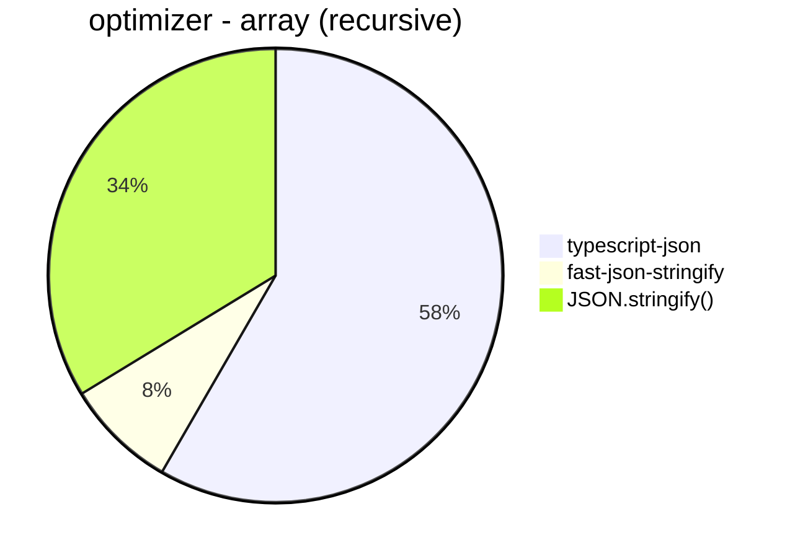
```mermaid
pie title optimizer - array (recursive)
  "typescript-json": 190.97345132743362
  "fast-json-stringify": 25.993044114955154
  "JSON.stringify()": 110.35747021081576
```

```mermaid
pie title optimizer - array (union)
  "typescript-json": 292.57720787430014
  "fast-json-stringify": 1.4842300556586272
  "JSON.stringify()": 209.63636363636363
```

```mermaid
pie title optimizer - ultimate union
  "typescript-json": 990.3915881073242
  "fast-json-stringify": 0
  "JSON.stringify()": 158.51481613709387
```

## stringify
 Components | typescript-json | fast-json-stringify | JSON.stringify() 
------------|-----------------|---------------------|------------------
object (simple) | 28804.027328299173 | 24390.920786620107 | 5323.771240635849
object (hierarchical) | 4668.460111317255 | 4414.301511242167 | 1332.3137819359483
object (recursive) | 4124.563659746464 | 1002.0083987584444 | 1060.0453172205437
object (union) | 1553.4191910030836 | 1218.613933236575 | 790.2775190910785
array (hierarchical) | 219.4632097863794 | 300.9886488465764 | 106.39840493021569
array (recursive) | 198.193315266486 | 112.31343283582089 | 112.33439074454189
array (union) | 304.53879941434843 | 195.15801145814083 | 213.3431085043988
ultimate union | 1021.5509301897218 | Failed | 159.52679691701022

```mermaid
pie title stringify - object (simple)
  "typescript-json": 28804.027328299173
  "fast-json-stringify": 24390.920786620107
  "JSON.stringify()": 5323.771240635849
```

```mermaid
pie title stringify - object (hierarchical)
  "typescript-json": 4668.460111317255
  "fast-json-stringify": 4414.301511242167
  "JSON.stringify()": 1332.3137819359483
```

```mermaid
pie title stringify - object (recursive)
  "typescript-json": 4124.563659746464
  "fast-json-stringify": 1002.0083987584444
  "JSON.stringify()": 1060.0453172205437
```

```mermaid
pie title stringify - object (union)
  "typescript-json": 1553.4191910030836
  "fast-json-stringify": 1218.613933236575
  "JSON.stringify()": 790.2775190910785
```

```mermaid
pie title stringify - array (hierarchical)
  "typescript-json": 219.4632097863794
  "fast-json-stringify": 300.9886488465764
  "JSON.stringify()": 106.39840493021569
```

```mermaid
pie title stringify - array (recursive)
  "typescript-json": 198.193315266486
  "fast-json-stringify": 112.31343283582089
  "JSON.stringify()": 112.33439074454189
```

```mermaid
pie title stringify - array (union)
  "typescript-json": 304.53879941434843
  "fast-json-stringify": 195.15801145814083
  "JSON.stringify()": 213.3431085043988
```

```mermaid
pie title stringify - ultimate union
  "typescript-json": 1021.5509301897218
  "fast-json-stringify": 0
  "JSON.stringify()": 159.52679691701022
```

