# Benchmark of `typescript-json`
> CPU: Intel(R) Core(TM) i7-6700 CPU @ 3.40GHz
> Memory: 16,323 MB
> NodeJS version: v18.6.0

## assert
 Components | typescript-json | typescript-is 
------------|-----------------|---------------
object (hierarchical) | 16586.529803709705 | 14542.229425535746
object (recursive) | 22624.37115707099 | 15814.373420007221
object (union) | 3738.2045162474756 | 1508.1315504156125
array (recursive) | 933.1193151417871 | 1116.262091622559
array (union) | 2323.7410071942445 | 152.34089246525238
ultimate union | 3187.0490620490623 | 21.8529889832039

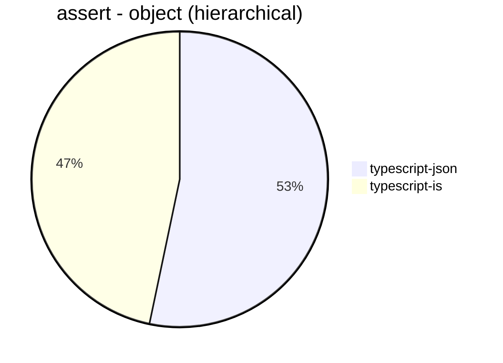
```mermaid
pie title assert - object (hierarchical)
  "typescript-json": 16586.529803709705
  "typescript-is": 14542.229425535746
```

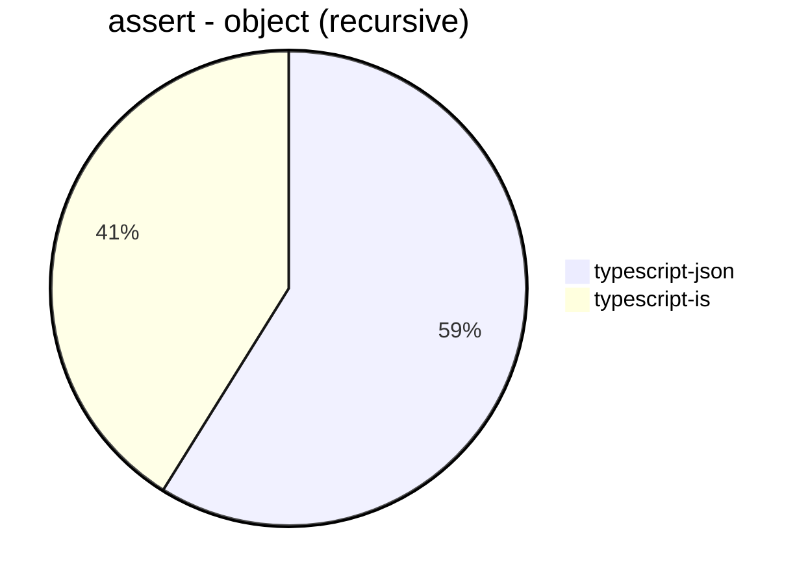
```mermaid
pie title assert - object (recursive)
  "typescript-json": 22624.37115707099
  "typescript-is": 15814.373420007221
```

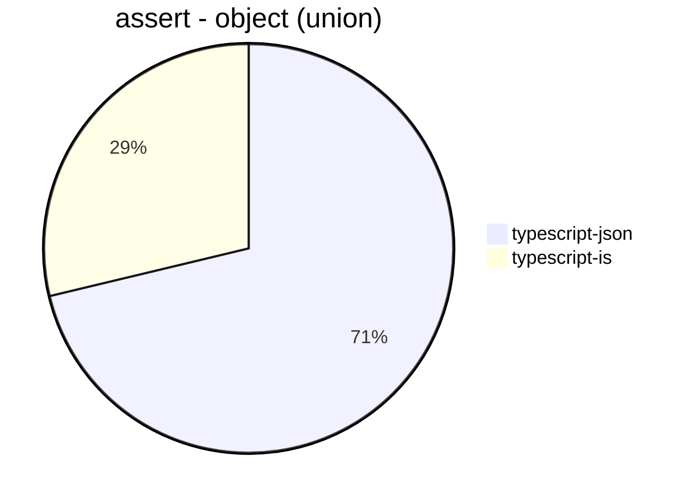
```mermaid
pie title assert - object (union)
  "typescript-json": 3738.2045162474756
  "typescript-is": 1508.1315504156125
```

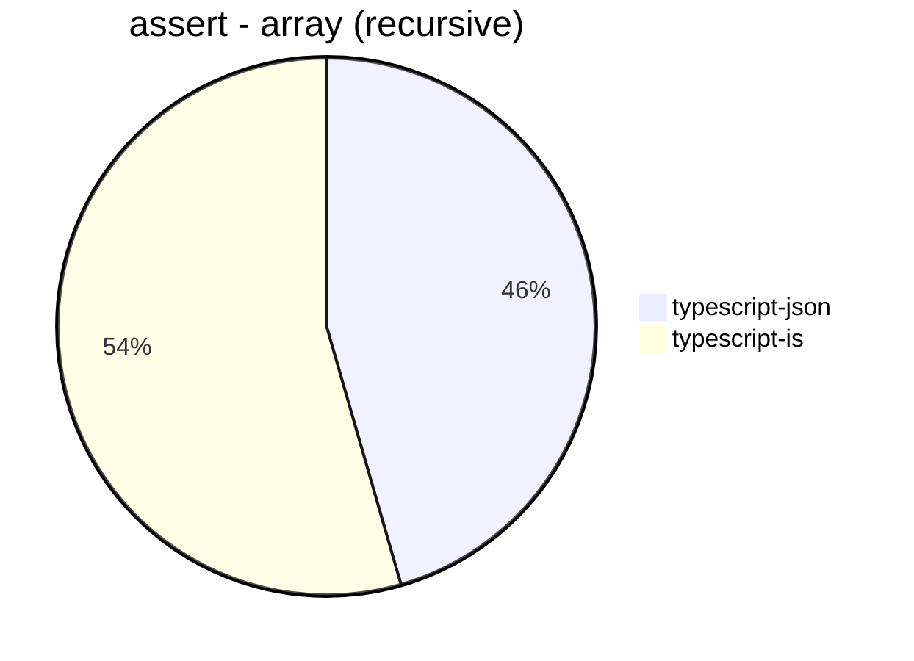
```mermaid
pie title assert - array (recursive)
  "typescript-json": 933.1193151417871
  "typescript-is": 1116.262091622559
```

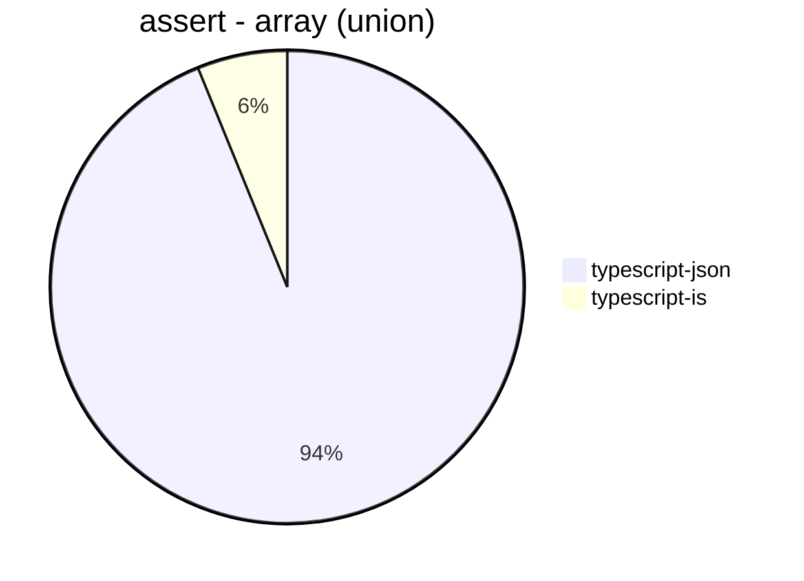
```mermaid
pie title assert - array (union)
  "typescript-json": 2323.7410071942445
  "typescript-is": 152.34089246525238
```

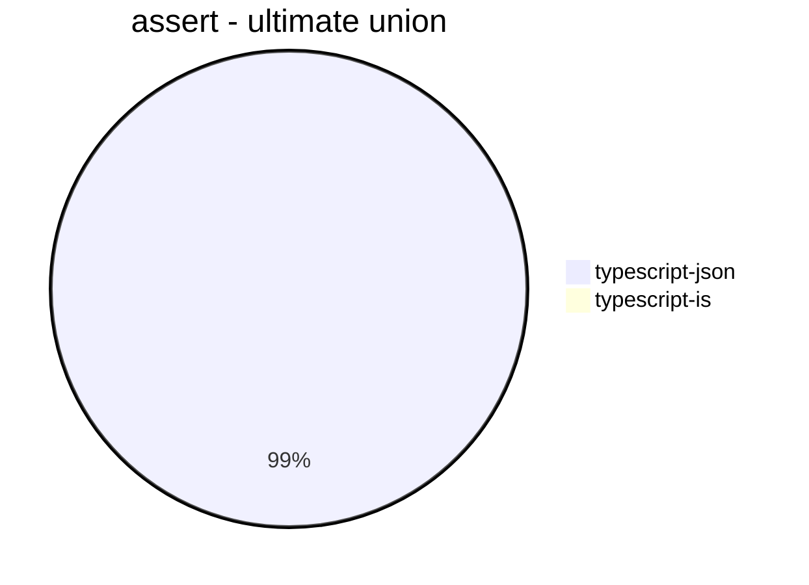
```mermaid
pie title assert - ultimate union
  "typescript-json": 3187.0490620490623
  "typescript-is": 21.8529889832039
```

## is
 Components | typescript-json | typescript-is | ajv 
------------|-----------------|---------------|-----
object (hierarchical) | 61506.599739728576 | 30001.642036124795 | 33130.78767755027
object (recursive) | 44578.04208600183 | 24103.295893942184 | Failed
object (union, explicit) | 9514.5333092616 | Failed | 728.0234905487246
object (union, implicit) | 8405.823148813803 | Failed | Failed
array (recursive) | 3301.6314423433446 | 2272.5131364377603 | Failed
array (union, explicit) | 4148.296593186373 | 718.645948945616 | Failed
array (union, implicit) | 4631.346578366446 | 733.9497557571528 | Failed
ultimate union | 6509.76778474014 | 209.19582341088113 | Failed

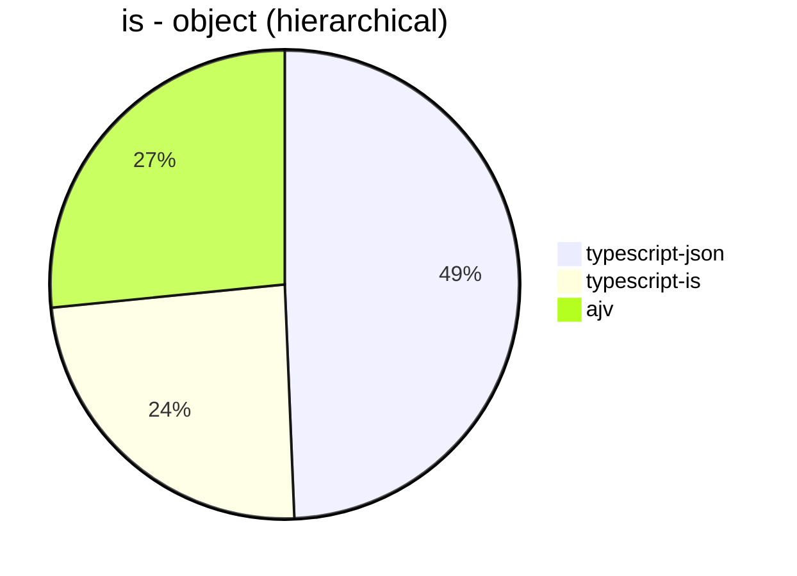
```mermaid
pie title is - object (hierarchical)
  "typescript-json": 61506.599739728576
  "typescript-is": 30001.642036124795
  "ajv": 33130.78767755027
```

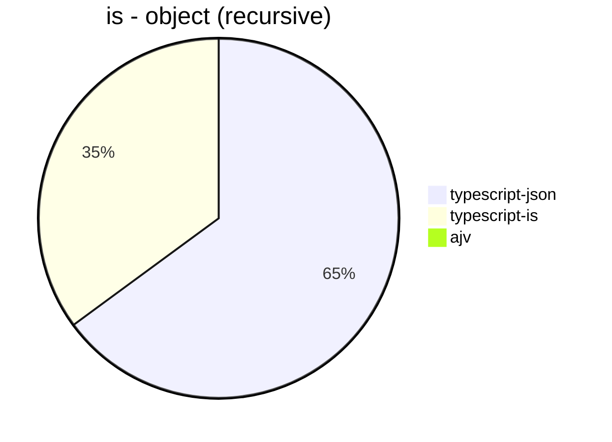
```mermaid
pie title is - object (recursive)
  "typescript-json": 44578.04208600183
  "typescript-is": 24103.295893942184
  "ajv": 0
```

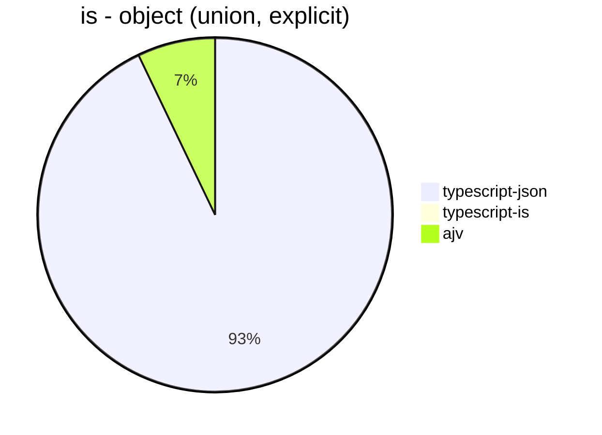
```mermaid
pie title is - object (union, explicit)
  "typescript-json": 9514.5333092616
  "typescript-is": 0
  "ajv": 728.0234905487246
```

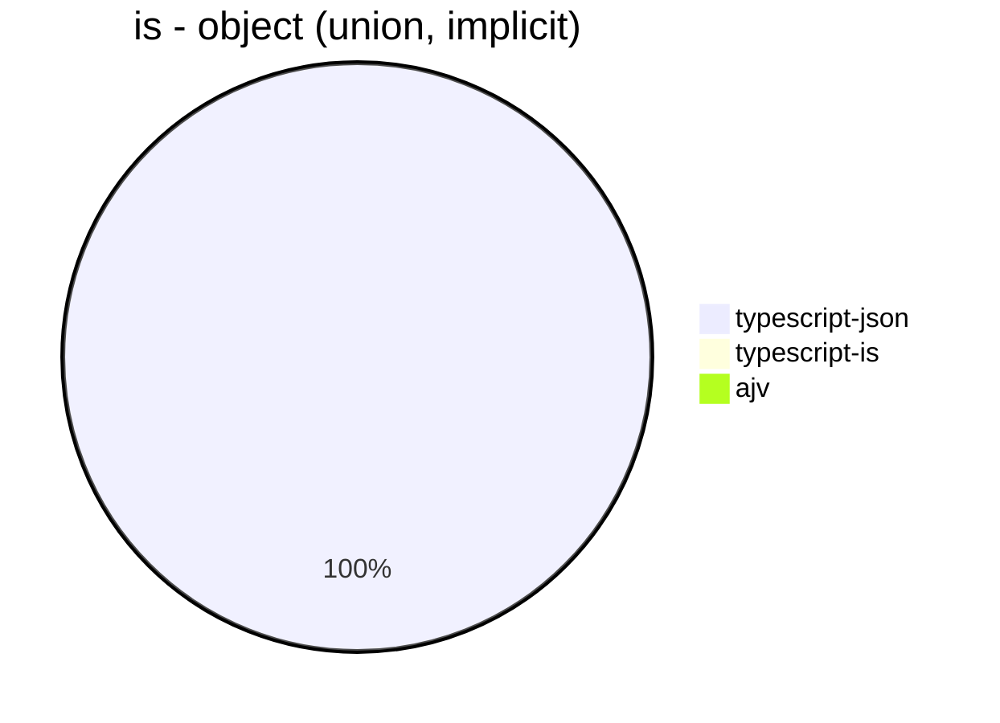
```mermaid
pie title is - object (union, implicit)
  "typescript-json": 8405.823148813803
  "typescript-is": 0
  "ajv": 0
```

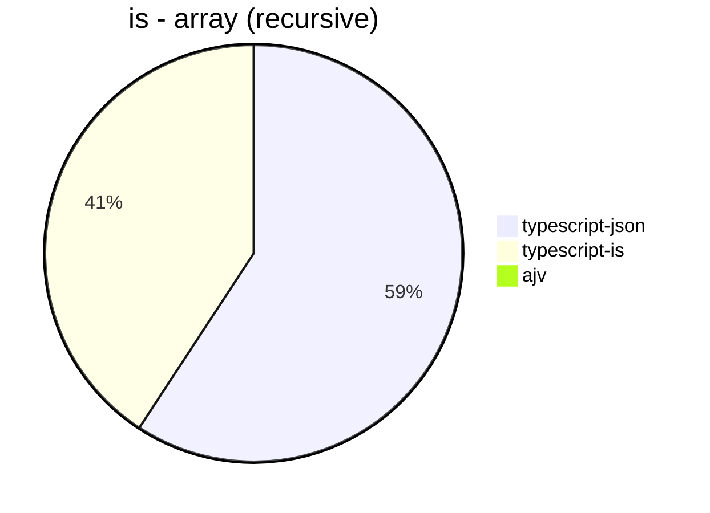
```mermaid
pie title is - array (recursive)
  "typescript-json": 3301.6314423433446
  "typescript-is": 2272.5131364377603
  "ajv": 0
```

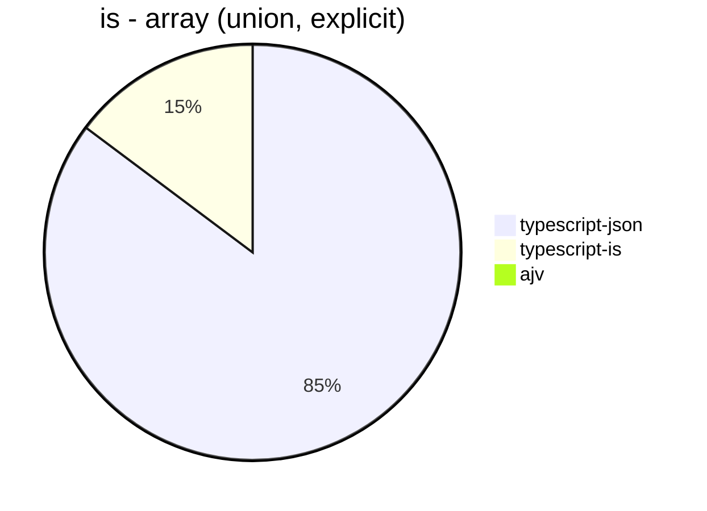
```mermaid
pie title is - array (union, explicit)
  "typescript-json": 4148.296593186373
  "typescript-is": 718.645948945616
  "ajv": 0
```

```mermaid
pie title is - array (union, implicit)
  "typescript-json": 4631.346578366446
  "typescript-is": 733.9497557571528
  "ajv": 0
```

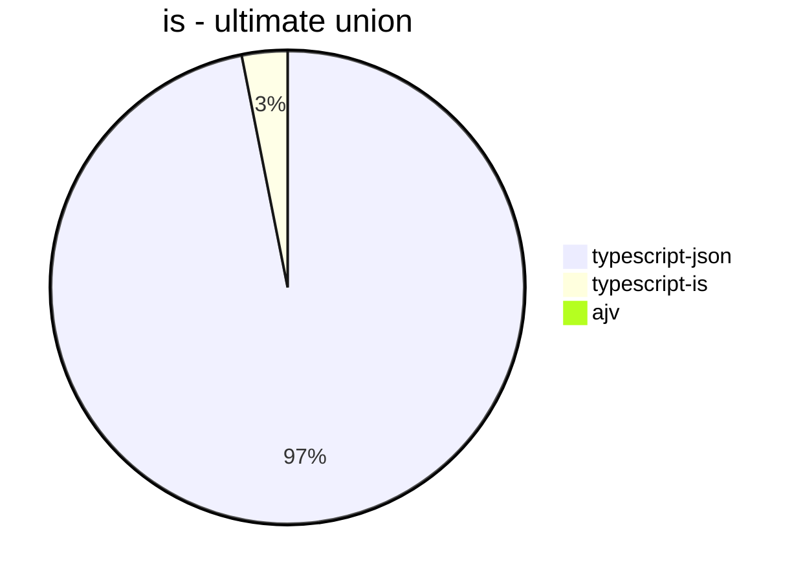
```mermaid
pie title is - ultimate union
  "typescript-json": 6509.76778474014
  "typescript-is": 209.19582341088113
  "ajv": 0
```

## optimizer
 Components | typescript-json | fast-json-stringify | JSON.stringify() 
------------|-----------------|---------------------|------------------
object (simple) | 28170.673952641166 | 4.578270822327874 | 5604.814253222138
object (hierarchical) | 4540.319651289502 | 0.9324878776575904 | 1340.3867201751186
object (recursive) | 4116.429495472186 | 32.06450403150197 | 1021.9018068990691
object (union) | 1433.3951762523193 | 0.7270083605961469 | 786.1389817911557
array (hierarchical) | 93.42819696686014 | 1.8646280067126606 | 46.89184333453108
array (recursive) | 185.23222060957912 | 26.241268642627904 | 109.37215650591446
array (union) | 286.2830256967065 | 1.4751982297621242 | 212.56931608133087
ultimate union | 943.416956601355 | Failed | 162.36299461266952

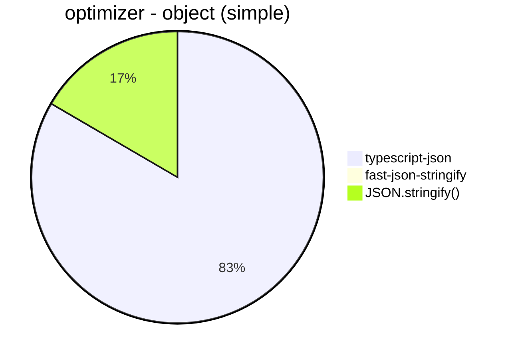
```mermaid
pie title optimizer - object (simple)
  "typescript-json": 28170.673952641166
  "fast-json-stringify": 4.578270822327874
  "JSON.stringify()": 5604.814253222138
```

```mermaid
pie title optimizer - object (hierarchical)
  "typescript-json": 4540.319651289502
  "fast-json-stringify": 0.9324878776575904
  "JSON.stringify()": 1340.3867201751186
```

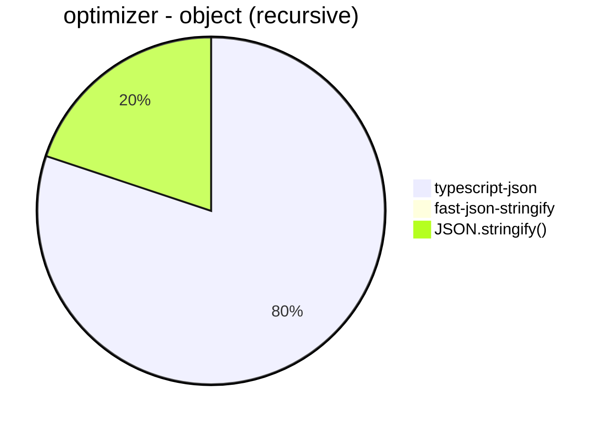
```mermaid
pie title optimizer - object (recursive)
  "typescript-json": 4116.429495472186
  "fast-json-stringify": 32.06450403150197
  "JSON.stringify()": 1021.9018068990691
```

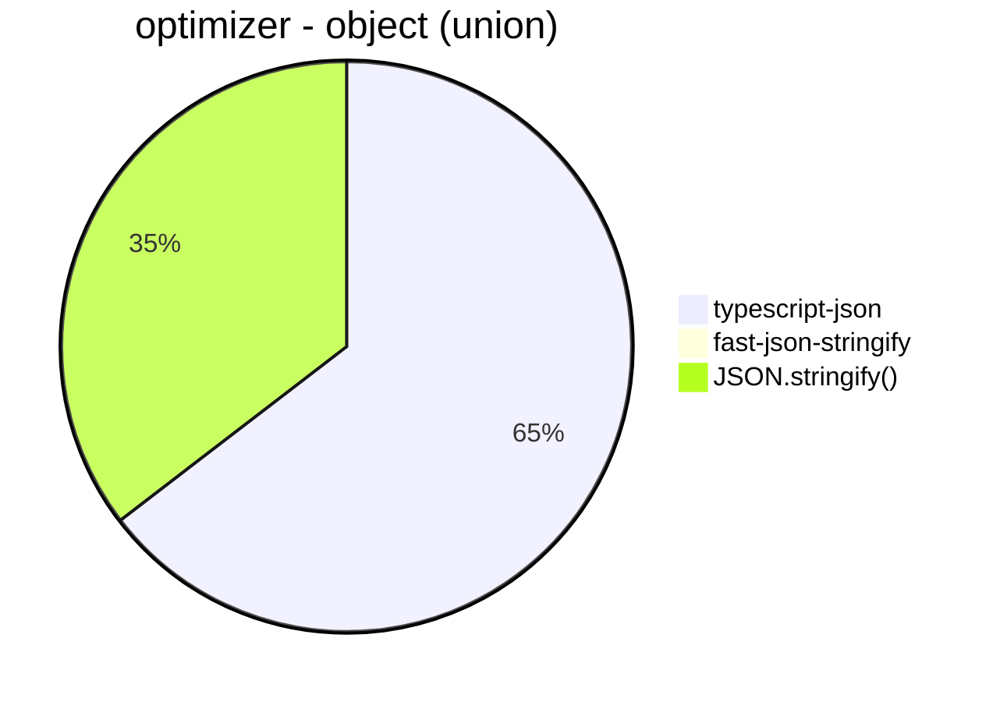
```mermaid
pie title optimizer - object (union)
  "typescript-json": 1433.3951762523193
  "fast-json-stringify": 0.7270083605961469
  "JSON.stringify()": 786.1389817911557
```

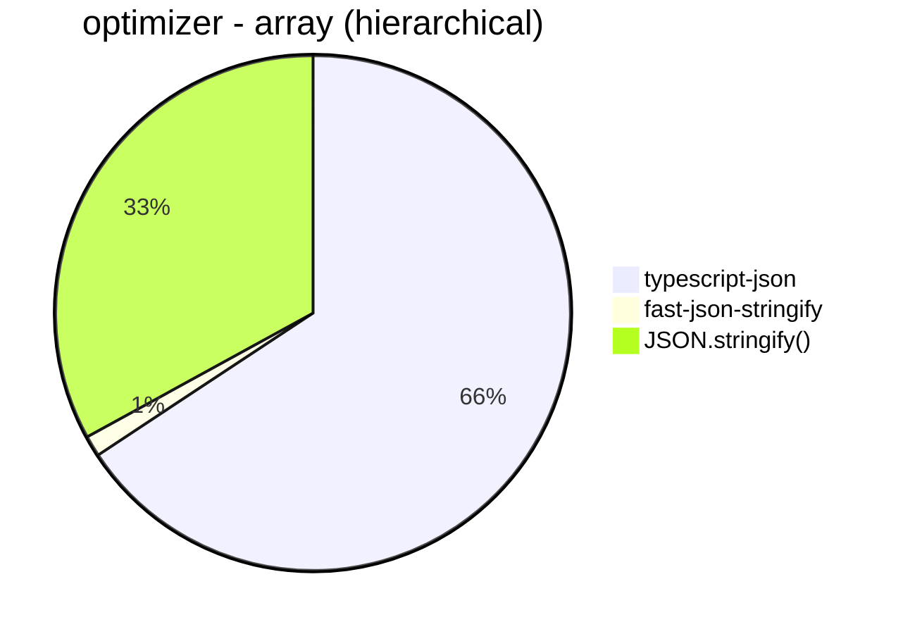
```mermaid
pie title optimizer - array (hierarchical)
  "typescript-json": 93.42819696686014
  "fast-json-stringify": 1.8646280067126606
  "JSON.stringify()": 46.89184333453108
```

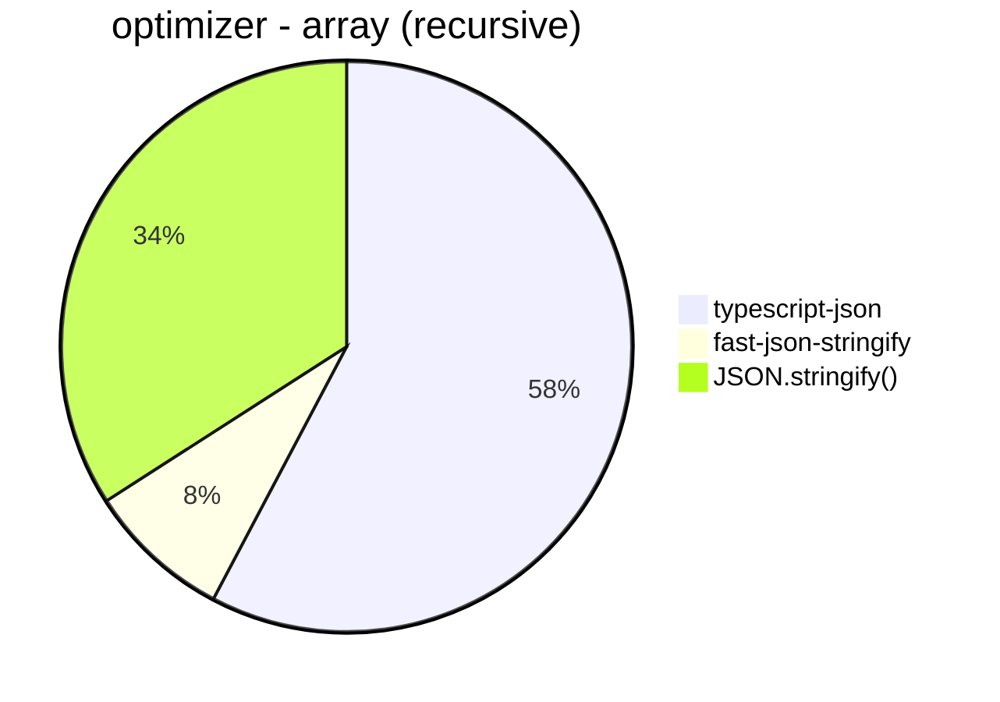
```mermaid
pie title optimizer - array (recursive)
  "typescript-json": 185.23222060957912
  "fast-json-stringify": 26.241268642627904
  "JSON.stringify()": 109.37215650591446
```

```mermaid
pie title optimizer - array (union)
  "typescript-json": 286.2830256967065
  "fast-json-stringify": 1.4751982297621242
  "JSON.stringify()": 212.56931608133087
```

```mermaid
pie title optimizer - ultimate union
  "typescript-json": 943.416956601355
  "fast-json-stringify": 0
  "JSON.stringify()": 162.36299461266952
```

## stringify
 Components | typescript-json | fast-json-stringify | JSON.stringify() 
------------|-----------------|---------------------|------------------
object (simple) | 27249.48414931532 | 22916.759568933485 | 5284.930504754938
object (hierarchical) | 4452.3200584581655 | 4317.98084008843 | 1324.2085661080075
object (recursive) | 4104.251386321626 | 1024.666172106825 | 1025.325747843641
object (union) | 1520.5753823743628 | 1223.3558025141192 | 785.4877821301997
array (hierarchical) | 79.26940639269407 | 112.5803489439853 | 41.64403403947131
array (recursive) | 197.29678993805143 | 110.71827316710086 | 111.94169314146889
array (union) | 295.8947929625022 | 198.3177570093458 | 207.17131474103584
ultimate union | 917.8131788559015 | Failed | 162.04808221692053

```mermaid
pie title stringify - object (simple)
  "typescript-json": 27249.48414931532
  "fast-json-stringify": 22916.759568933485
  "JSON.stringify()": 5284.930504754938
```

```mermaid
pie title stringify - object (hierarchical)
  "typescript-json": 4452.3200584581655
  "fast-json-stringify": 4317.98084008843
  "JSON.stringify()": 1324.2085661080075
```

```mermaid
pie title stringify - object (recursive)
  "typescript-json": 4104.251386321626
  "fast-json-stringify": 1024.666172106825
  "JSON.stringify()": 1025.325747843641
```

```mermaid
pie title stringify - object (union)
  "typescript-json": 1520.5753823743628
  "fast-json-stringify": 1223.3558025141192
  "JSON.stringify()": 785.4877821301997
```

```mermaid
pie title stringify - array (hierarchical)
  "typescript-json": 79.26940639269407
  "fast-json-stringify": 112.5803489439853
  "JSON.stringify()": 41.64403403947131
```

```mermaid
pie title stringify - array (recursive)
  "typescript-json": 197.29678993805143
  "fast-json-stringify": 110.71827316710086
  "JSON.stringify()": 111.94169314146889
```

```mermaid
pie title stringify - array (union)
  "typescript-json": 295.8947929625022
  "fast-json-stringify": 198.3177570093458
  "JSON.stringify()": 207.17131474103584
```

```mermaid
pie title stringify - ultimate union
  "typescript-json": 917.8131788559015
  "fast-json-stringify": 0
  "JSON.stringify()": 162.04808221692053
```

